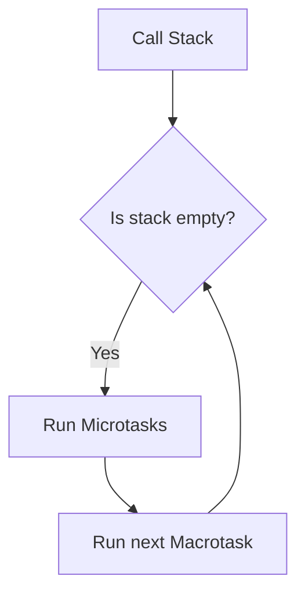
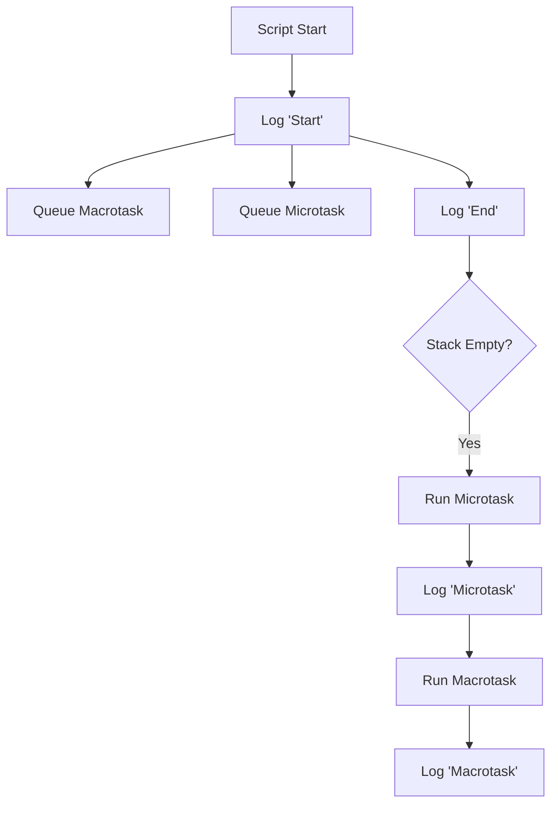
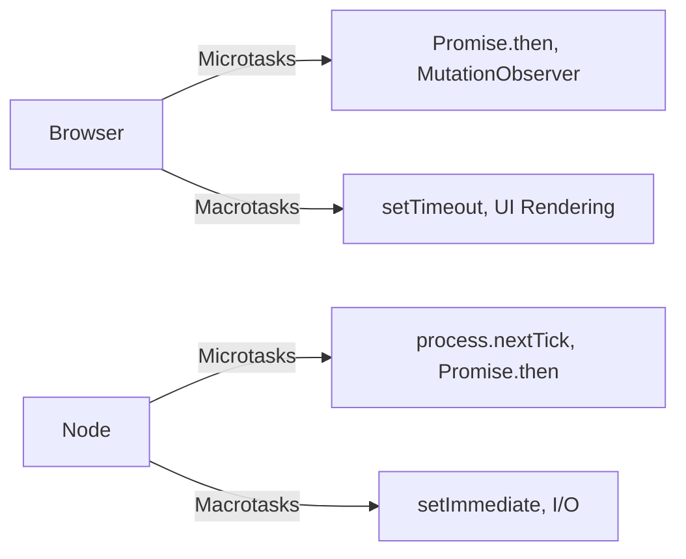

# Microtasks vs. Macrotasks: A Deep Dive into JavaScript's Event Loop

A comprehensive guide to understanding how JavaScript prioritizes and executes asynchronous operations.

---

## Table of Contents

1. [Overview](#overview)
2. [Key Differences](#key-differences)
3. [Event Loop Workflow](#event-loop-workflow)
4. [Microtasks Explained](#microtasks-explained)
5. [Macrotasks Explained](#macrotasks-explained)
6. [Execution Order Examples](#execution-order-examples)
7. [Common Pitfalls](#common-pitfalls)
8. [Best Practices](#best-practices)
9. [Visualization with Mermaid](#visualization-with-mermaid)
10. [FAQ](#faq)

---

## Overview <a name="overview"></a>

JavaScript's concurrency model relies on:

- **Microtasks**: High-priority tasks (e.g., Promises, DOM updates).
- **Macrotasks**: Lower-priority tasks (e.g., I/O, timers).
- **Event Loop**: Orchestrates their execution.

---

## Key Differences <a name="key-differences"></a>

| Feature        | Microtasks                                                                         | Macrotasks                                                               |
| -------------- | ---------------------------------------------------------------------------------- | ------------------------------------------------------------------------ |
| **Queue Type** | Single queue (`microtaskQueue`)                                                    | Multiple queues (timers, I/O, etc.)                                      |
| **Priority**   | Higher (executed first)                                                            | Lower                                                                    |
| **Execution**  | All microtasks drained per cycle                                                   | One macrotask per cycle                                                  |
| **Examples**   | `Promise.then`, `queueMicrotask`, `MutationObserver`, `process.nextTick` (Node.js) | `setTimeout`, `setInterval`, I/O, `setImmediate` (Node.js), UI Rendering |

---

## Event Loop Workflow <a name="event-loop-workflow"></a>



1. Executes **all microtasks** before any **macrotask**.
2. Renders UI updates (if needed) after microtasks.

---

## Microtasks Explained <a name="microtasks-explained"></a>

#### What They Do

- Handle **immediate follow-up actions** (e.g., promise resolutions).

- Execute before the browser renders the next frame.

#### Examples

- **Browser:**

```javascript
// Promise
Promise.resolve().then(() => console.log("Microtask 1"));

// queueMicrotask API
queueMicrotask(() => console.log("Microtask 2"));

// DOM MutationObserver
const observer = new MutationObserver(() => console.log("DOM changed!"));
observer.observe(document.body, { childList: true });
```

- **Node.js:**

```javascript
// process.nextTick (higher priority than Promises)
process.nextTick(() => console.log("NextTick"));
```

---

## Macrotasks Explained <a name="macrotasks-explained"></a>

#### What They Do

- Handle **heavy/non-urgent operations** (e.g., network requests).

- Ensure the UI remains responsive.

#### Examples

- **Browser:**

```javascript
// setTimeout/setInterval
setTimeout(() => console.log("Timeout"), 0);

// UI Rendering
requestAnimationFrame(() => console.log("Rendered Frame"));

// Events
button.addEventListener("click", () => console.log("Clicked"));
```

- **Node.js:**

```javascript
// I/O Operations
fs.readFile("file.txt", () => console.log("File read"));

// setImmediate
setImmediate(() => console.log("setImmediate"));
```

---

## Execution Order Examples <a name="execution-order-examples"></a>

#### Example 1: Basic Priority

```javascript
console.log("Start");

setTimeout(() => console.log("Macrotask"), 0);
Promise.resolve().then(() => console.log("Microtask"));

console.log("End");

// Output:
// Start
// End
// Microtask
// Macrotask
```

#### Example 2: Nested Queues

```javascript
Promise.resolve().then(() => {
  console.log("Microtask 1");
  queueMicrotask(() => console.log("Nested Microtask"));
});

setTimeout(() => console.log("Macrotask"), 0);

// Output:
// Microtask 1
// Nested Microtask
// Macrotask
```

---

## Common Pitfalls <a name="common-pitfalls"></a>

1. **Microtask Starvation**

```javascript
function loop() {
  Promise.resolve().then(loop); // Blocks macrotasks indefinitely
}
loop();
```

2. **UI Freezes**

   - Long microtask chains delay rendering/input handling.

3. **Node.js vs Browser Differences**

   - `process.nextTick` > Promises (Node.js)

   - `requestAnimationFrame` is a macrotask (Browser).

---

## Best Practices <a name="best-practices"></a>

1. **Break Up Long Microtasks:** `Use setTimeout(fn, 0)` to yield to macrotasks.

2. **Prioritize Critical Updates:** Use microtasks for DOM changes needing immediate effect.

3. **Avoid Recursive Microtasks:** Unless intentional (e.g., polling with `queueMicrotask`).

---

## Visualization with Mermaid <a name="visualization-with-mermaid"></a>

#### Event Loop Flow



#### Node.js vs Browser



---

## FAQ <a name="faq"></a>

**Q: Why do microtasks run before macrotasks?**
A: To ensure urgent follow-up actions (e.g., promise chains) complete before heavy tasks.

**Q: Can microtasks interrupt other code?**
A: No – they only run when the call stack is empty.

**Q: Is requestAnimationFrame a microtask?**
A: No – it’s a macrotask scheduled before the next repaint.

**Q: How does process.nextTick differ from Promises in Node.js?**
A: process.nextTick runs before Promises in the microtask queue.

---

### References

[MDN Web Docs: Event Loop](https://developer.mozilla.org/en-US/docs/Web/JavaScript/Event_loop)
[Node.js Event Loop Guide](https://nodejs.org/en/learn/asynchronous-work/event-loop-timers-and-nexttick)
